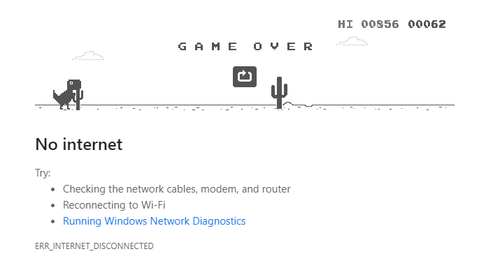

# SuperSpeedDino

## Beat the Chrome Dinosaur game using genetic algorithms (and A.I. eventually...)

## Playing the Game
The game is played by creating a `Player` object, and using the method `Player.play()`.
This will give you a delay of 1 second, during which the user must focus the game screen
by clicking on it. 

The Player object will read in the screen input, and use the *PyAutoGui* library to 
simulate jumping and ducking over obstacles. Get a 
refreshing beverage, and watch the algorithm learn to master
the game!

## How the Player Learns

## Implementation Details

### Image Capturing
Game information is captured done using the ScreenCapture object, which uses the MSS module under the hood to
capture a window from the screen. 

## Object recognition
Objects are recognized using `opencv.MatchTemplate()`, against the example obstacle files in
images/obstacle_images.

The (x,y) position of pixel matches are passed to the player object, done in `Player.play()`, 
which looks up a list position and executes the corresponding keypress, for some time.
