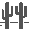

# SuperSpeedDino

## Beat the Chrome Dinosaur game using genetic algorithms (and R.L. eventually...)


## How it Works

### The Player Object
The information to play the game is encoded in the `Player` object, whose key element is the `Player.decisionGenes` dictionary.   
This dictionary has 7 keys, one for each type of obstacle that can be encountered in the game, shown below, as well as the game-over screen.  

Each key in the dictionary contains an **array of length 500**, with each element containing a tuple of (keypress, duration) to execute.  
The keypress actions can correspond to 1 of 3 possibilities, `[jump, duck, do nothing]`.  

```python
Player.decisionGenes = {
  ...
  "Single Cactus": [ (jump, 1.112), (Do nothing, 0.289), (jump, 0.934), ..., (duck, 0.853) ]
  ...
}
```

Each keypress is protected by a `mutex`, which is released when the duration for the action is completed.
This mutex is released through a `threading.Timer` object, which allows asynchronous executing instead of blocking.  
Therefore the player is able to execute an action, and continue to collect information about the obstacle location.

### Game Vision

Game vision is done using the ImageProcess and ScreenCapture Objects. The ScreenCapture object uses the  *MSS* library
to capture a 500px wide image of the game. This image is passed to the ImageProcess object,  
which uses *OpenCV*'s `cv2.matchTemplate()` method to search for obstacles in the image. 

Other processing is done through the openCV library to prepare the image for searching, such as removing transparency,
as well as adding annotations to visualize the information that the player object is receiving.

The (x, y) coordinates of closest object detected in each frame is returned, and the player selects the corresponding  
element from the array for the obstacle, executing the action for the specified amount of time.

* Single Cactus 
* Single Cactus small 
* Two cacti 
* Two cacti, small 
* Triple cacti, small 
* Quadruple cacti 
* Game over 

### Scoring
Scoring is done using the *Pytesseract* OCR library, which converts a score, like below, into text.  
This approach occasionaly produces errors, due to the nature of the pixelated font of the score.  

As the library uses a neural network to interpret the characters, in the future it will be retrained 
similar to a transfer learning model, where the last few layers of the network are removed and fed
custom training data. 

Due to the time and effort it takes to collect and label all the required data, this is currently
under development.

## Learning and the Genetic Algorithm

The Genetic Algorithm is implemented using the *DEAP* library.  
It initializes a population of player objects, and uses mutation and crossover
to improve its results. 

Crossover creates a new player that is a mix of two others, hopefully improving its
performance. The arrays for each obstacle are crossed over, visualized below.
This new player has parts of both original players that were mixed to create it.


Mutation alters some aspect of a player that already exists. This occurs randomly
in any of the arrays for each obstacle, affecting either what action is done,
or how long is it done for.

### Evolving over time

Some population of Player objects are created, with all their actions for each obstacle chosen at random.  
All players play the game, and some undergo crossover and mutation. These new players, plus the unmodified old ones,
become the new population. 

This iterative process continues as the players are mixed and edited to produce better results.

## Playing the Game
The game is played by creating a `Player` object, and using the method `Player.play()`.
This will give you a delay of 1 second, during which the user must focus the window with the game, by clicking on it. 

The Player object will read in the screen input, and use the *PyAutoGui* library to 
simulate jumping and ducking over obstacles. Get a 
refreshing beverage, and watch the algorithm learn to master
the game!
